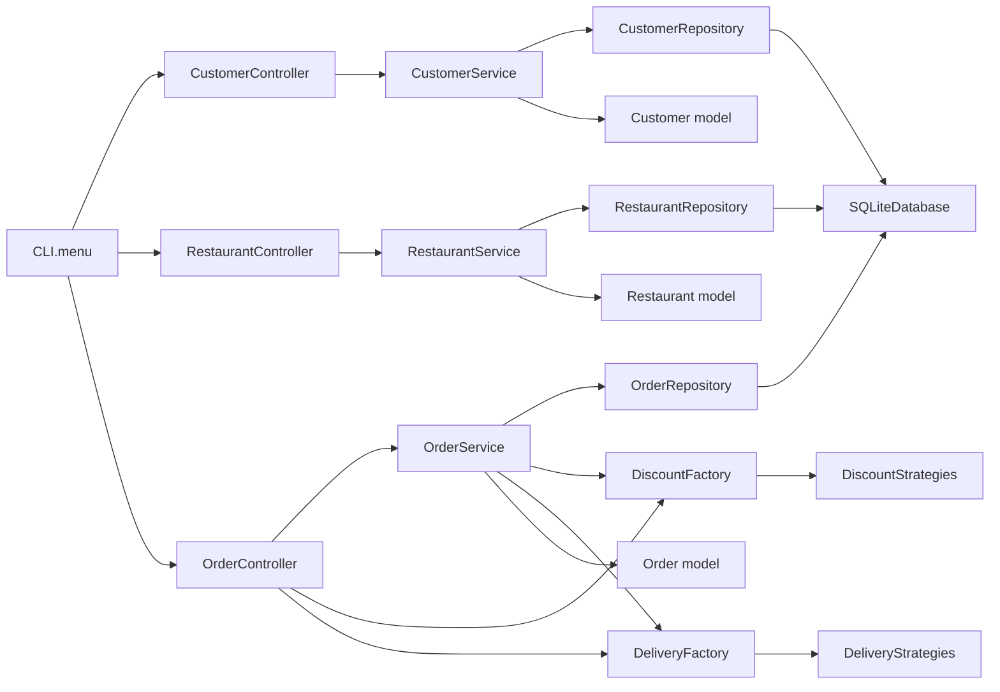

# Food Delivery Project — Flow Diagrams

This repository contains a simple Food Delivery application. Below are visual diagrams describing the control flow.

## Flow Diagram



## Sequence Diagram — Create Order

See `diagrams/sequence_create_order.mmd` for the sequence diagram showing the Create Order interaction.

## Generating PNGs (optional)

Install `mermaid-cli` and generate PNGs locally:

```bash
npm install -g @mermaid-js/mermaid-cli
mmdc -i diagrams/flow.mmd -o diagrams/flow.png
mmdc -i diagrams/sequence_create_order.mmd -o diagrams/sequence_create_order.png
```

Or tell me and I can try to render PNGs here if permitted.
